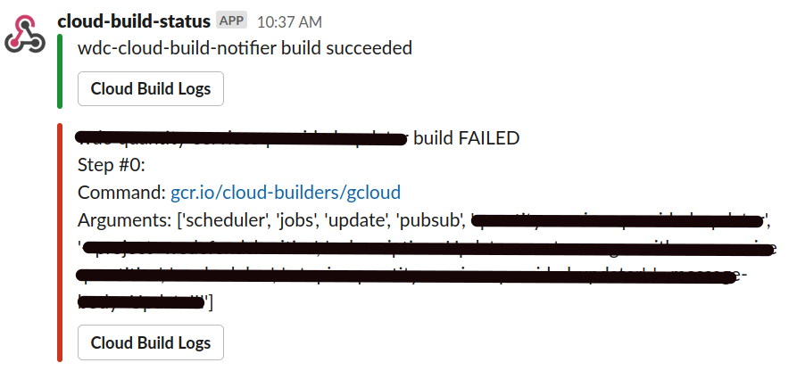

# GCP Cloud Build Slack Notifier

## Purpose
Via a Cloud Function, send a Slack webhook notification when a GCP Cloud Build successfully completes or fails via build-in Cloud Build Pub/Sub notifications.

## Overview
Given a Pub/Sub topic called cloud-builds, Cloud Build will automatically send build status notifications to the topic. The Cloud Function deployed here watches the topic and sends slack notifications to Slack on successes and failtures.

## Requirements if webhook URL is in the code
* Existing Slack webhook URL and Cloud Build APIs and Cloud Functions enabled
* cloud-builds Pub/Sub topic that Cloud Build is sending Pub/Sub messages to (to create topic: gcloud pubsub topics create cloud-builds)

## Optional if webhook URL is in Secret Manager
* Service account with roles/secretmanager.secretAccessor
* Secret Manager secret with the webhook URL in it

## Configuration
* Replace your project ID in source/main.py in place of "{PROJECT_ID}"
* (optional) Replace your secret manager secret ID in source/main.py in place of "{SECRET_ID}"
* (optional) Insert your slack webhook url into source/main.py for the SLACK_WEBHOOK variable

## Deploy Cloud Function via bash script, optional service account if using secret manager
* Run: deploy_function.sh {PROJECT_ID} ({SERVICE_ACCOUNT})

## Deploy Cloud Function via Cloud Build trigger
1. Modify the cloudbuild.yaml, putting your project ID in place of {PROJECT_ID} and service account in place of {SERVICE_ACCOUNT} (or delete that line if not using secret manager)
* Documentation on the below steps: https://cloud.google.com/cloud-build/docs/automating-builds/create-manage-triggers
2. Add the code to a repo that you control and connect it to Cloud Build
4. Create a cloud build trigger for the repo
5. Run the trigger to deploy the cloud function

## Example Slack Notifications

## Notes
* There are a lot of other details that you can pull out of the Pub/Sub message.  This is a basic example.  If you look at the Cloud Function logs, you'll see the full Pub/Sub json message.

## Troubleshooting
* If the cloud-builds topic is not receiving Pub/Sub messages, disable and re-enable the Cloud Builds API after creating the topic.